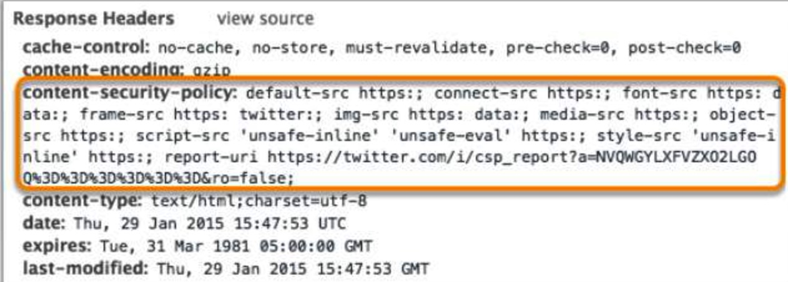

## CSP (内容安全策略)

<p class="tip">CSP [Content Security Policy] 译为：内容安全策略</p>

#### CSP的目的

XSS(Cross Site Scripting) 跨站脚本攻击是最常见也是危害最大的攻击手段，我们前端能够做一些能力范围内的处理，比如最简单的将表单内容脚本序列化为HTML实体，以防止恶意脚本的执行，但除此之外，还有很多跨站脚本攻击的方式，如下：

```html
<a href="javascript:alert(1)"></a>
<iframe src="javascript:alert(1)"></iframe>

<video src="x" onerror="alert(1)"></video>
<div onclick="alert(1)" onmouseover="alert(2)"><div></div></div>
```

利用 `javascript:..` 以及 内联事件进行攻击。

为了阻止这些攻击，我们前端也要做不少相应的工作，于是很多人提出能不能从根本上解决问题，让浏览器帮我们做这些事情，这就是 CSP 提出的原因和要解决的问题。

#### CSP 的原理以及开启方式

###### 原理

原理其实就是白名单机制，开发者明确告诉客户端(浏览器)哪些资源可以加载并执行，我们只需要提供配置，其他的工作由客户端(浏览器)来完成。

###### 开启CSP的方式

一、通过 `<meta>` 标签开启

```html
<meta http-equiv="Content-Security-Policy" content="配置项" >
```

二、通过添加 `Content-Security-Policy` 响应头字段



#### 可配置的选项

```
default-src：用来设置每个选项的默认值

script-src：外部脚本
style-src：样式表
img-src：图像
media-src：媒体文件（音频和视频）
font-src：字体文件
object-src：插件（比如 Flash）
child-src：框架
frame-ancestors：嵌入的外部资源（比如<frame>、<iframe>、<embed>和<applet>）
connect-src：HTTP 连接（通过 XHR、WebSockets、EventSource等）
worker-src：worker脚本
manifest-src：manifest 文件

block-all-mixed-content：HTTPS 网页不得加载 HTTP 资源（浏览器已经默认开启）
upgrade-insecure-requests：自动将网页上所有加载外部资源的 HTTP 链接换成 HTTPS 协议
plugin-types：限制可以使用的插件格式
sandbox：浏览器行为的限制，比如不能有弹出窗口等。

report-uri：有时，我们不仅希望浏览器帮我们防止XSS的攻击，还希望将该行为上报到给定的网址，该选项用来配置上报的地址
```

#### 选项的值

每个限制选项可以设置以下几种值

* 主机名：`example.org`，`https://example.com:443`
* 路径名：`example.org/resources/js/`
* 通配符：`*.example.org`，`*://*.example.com:*`（表示任意协议、任意子域名、任意端口）
* 协议名：`https:`、`data:`
* 关键字'self'：当前域名，需要加引号
* 关键字'none'：禁止加载任何外部资源，需要加引号

###### 例子

```html
<meta http-equiv="Content-Security-Policy" content="script-src 'self'; object-src 'none'; style-src cdn.example.org third-party.org; child-src https:">
```

上面代码中，CSP 做了如下配置：

* 脚本：只信任当前域名
* `<object>` 标签：不信任任何URL，即不加载任何资源
* 样式表：只信任 `cdn.example.org` 和 `third-party.org`
* 框架（frame）：必须使用HTTPS协议加载
* 其他资源：没有限制


##csp

###  简介


```
CSP是网页安全政策(Content Security Policy)的缩写。是一种由开发者定义的安全性政策申明，通过CSP所约束的责任指定可信的内容来源，（内容可以是指脚本、图片、style 等远程资源）。通过CSP协定，可以防止XSS攻击，让web处一个安全运行的环境中。
       CSP 的实质就是白名单制度，开发者明确告诉客户端，哪些外部资源可以加载和执行，等同于提供白名单。它的实现和执行全部由浏览器完成，开发者只需提供配置。CSP 大大增强了网页的安全性。攻击者即使发现了漏洞，也没法注入脚本，除非还控制了一台列入了白名单的可信主机。
```


###  开启方式

　　一种是:通过 HTTP 头信息的Content-Security-Policy的字段。
　　一种是:在网页中设置<meta>标签，如:


```

 <meta http-equiv= <meta http-equiv=""Content-Security-PolicyContent-Security-Policy" content="script-src 'self'; object-src 'none'; style-src cdn.example.org third-party.org; child-src https:">
```

### 栗子


```
<script type="text/javascript" src="https://code.jquery.com/jquery-3.2.1.min.js"></script>　　
```

###script-src 的特殊值

```
'unsafe-inline':允许执行页面内嵌的<script>标签和事件监听函数
'unsafe-eval':允许将字符串当作代码执行，比如使用eval、setTimeout、setInterval等函数。
'nonce'值:每次HTTP回应给出一个授权token，页面内嵌脚本必须有这个token，才会执行
'hash'值:列出允许执行的脚本代码的Hash值，页面内嵌脚本的哈希值只有吻合的情况下，才能执行
```
